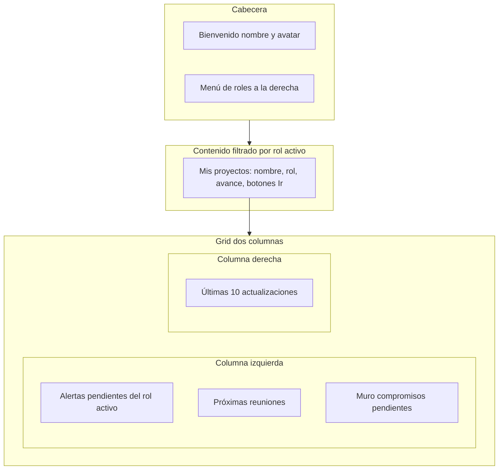

# Plan: Portal de Inicio del Usuario (actualizado)

## Objetivo

Transformar la página de Inicio (`src/app/page.tsx`) en un portal principal personalizado donde el usuario vea solo información relevante a sus proyectos (donde participa con algún rol). Incluye: cabecera con bienvenida y selector de rol global, listado de proyectos con rol y avance, alertas pendientes por rol, próximas reuniones, muro de compromisos pendientes, accesos rápidos por proyecto y últimas actualizaciones. Todo el contenido se filtra según el **rol activo** seleccionado en la cabecera, y ese selector actualiza el rol activo global (igual que "Mi cuenta" en el sidebar).

---

## 1. Cabecera de la página (zona superior)

### 1.1 Bienvenida y avatar

- **Izquierda:** texto **"Bienvenido, [Nombre del usuario]"** y **avatar** del usuario (misma imagen que en el sidebar / Mi cuenta).
- Obtener nombre e imagen de `session.user.name` y `session.user.image`.

### 1.2 Menú de roles (derecha de la cabecera)

- **Ubicación:** a la derecha de "Bienvenido + avatar", en la misma fila.
- **Contenido del menú:** solo los **roles con proyectos vigentes**, es decir, roles para los que el usuario tiene al menos un proyecto donde participa (fuente: `ProyectoParticipante` — `distinct(rol)` donde `userId = usuario actual`).
- **Comportamiento:**
  - Al elegir un rol se actualiza el **rol activo global**: misma lógica que en "Mi cuenta" (avatar en el sidebar): llamar a `updateUserProfile(session.user.id, { activeRole: newRole })` y `session.update({ activeRole: newRole })`. Así el rol elegido en Inicio es el mismo que en el resto de la app.
  - **Filtrado de toda la página:** todo el contenido debajo (Mis proyectos, alertas, reuniones, compromisos, historial) se filtra por el rol actualmente seleccionado: solo proyectos donde el usuario participa con ese rol.

### 1.3 Implementación técnica de la cabecera

- **Obtener roles con proyectos vigentes:** función/action que devuelva los roles a mostrar, por ejemplo `getRolesConProyectosVigentes()`: consultar `ProyectoParticipante` con `userId` del usuario y devolver lista única de `rol`.
- **Componente:** p. ej. `PortalWelcomeHeader`: recibe user (name, image), lista de roles vigentes y activeRole; renderiza "Bienvenido, [nombre]" + avatar y dropdown de roles que al cambiar llama a `updateUserProfile` + `session.update` (reutilizar lógica de [ProfileSidebar.tsx](src/components/ProfileSidebar.tsx) líneas 116-162).

---

## 2. Estructura de la página (orden visual)

1. **Cabecera:** Bienvenido + avatar (izq.) y menú de roles (der.).
2. **Mis proyectos:** listado (tabla o cards) con nombre del proyecto, rol del usuario, resumen de avance (p. ej. `avanceGantt` en barra o %), y botones pequeños "Ir" (Proyecto, Gantt, Seguimiento, Indicadores según se definan). Solo proyectos donde el usuario tiene el **rol activo**.
3. **Grid de dos columnas** (responsive: una columna en móvil):
   - **Izquierda (orden de arriba a abajo):** Alertas pendientes (solo del rol activo) → Próximas reuniones → Compromisos pendientes (muro). Todo filtrado por proyectos del rol activo.
   - **Derecha:** Últimas 10 actualizaciones (historial de proyectos del rol activo).

---

## 3. Filtrado por rol activo

- **Todas las actions del portal** deben considerar el **rol activo** (desde sesión o parámetro) y filtrar por él:
  - Proyectos: solo participaciones con `ProyectoParticipante.rol === activeRole`.
  - Compromisos, historial, reuniones, alertas: mismo conjunto de `proyectoIds` (proyectos donde el usuario tiene ese rol).
- **Alertas:** si el rol activo es Coordinador, solo se muestra contenido de coordinador (Actividades por validar, Indicadores por validar). Si es Encargado, solo Encargado (Actividades por evidenciar, Indicadores por evidenciar). No se muestran secciones de otros roles.

---

## 4. Secciones de contenido (detalle)

### 4.1 Mis proyectos

- **Datos:** action que devuelva proyectos del usuario **con el rol activo**: p. ej. `getProyectosDelUsuarioConRol(activeRole)`: `ProyectoParticipante` donde `userId` y `rol === activeRole`, incluir proyecto (id, proyecto, avanceGantt) y rol.
- **UI:** nombre del proyecto (enlace a detalle), rol, barra o % de avance (`avanceGantt`), botones "Ir" a: Proyecto, Gantt, Seguimiento (`/seguimiento?proyectoId=id`), Indicadores (según soporte de rutas).

### 4.2 Alertas pendientes

- **Coordinador (solo si rol activo = Coordinador):** "Actividades por validar", "Indicadores por validar" (en proyectos donde es coordinador).
- **Encargado (solo si rol activo = Encargado):** "Actividades por evidenciar (evidencias pendientes)", "Indicadores por evidenciar" (en proyectos donde es encargado).
- **Datos:** action `getAlertasPortalUsuario(activeRole)` que devuelva solo las alertas del rol indicado y solo para proyectos donde el usuario tiene ese rol. Estructura por tipo: listas de actividades/indicadores con nombre y proyecto, para enlazar a Gantt/Indicadores.

### 4.3 Próximas reuniones

- Solo reuniones de proyectos donde el usuario tiene el **rol activo**.
- **Datos:** `getProximasReunionesParaUsuario(activeRole, limit)`: proyectoIds = proyectos del usuario con ese rol; reuniones con `fecha >= hoy`, orden ascendente, limit 10; incluir proyecto (id, proyecto).
- **UI:** lista con nombre del proyecto y nombre/fecha de la reunión. **Solo el nombre/fecha de la reunión es clicable** → enlace a `/seguimiento?proyectoId=xxx`. Sin botones adicionales.

### 4.4 Compromisos pendientes (muro de post-it)

- Solo compromisos pendientes (`completado: false`) de proyectos donde el usuario tiene el **rol activo**.
- **Datos:** `getCompromisosPendientesParaUsuario(activeRole)`: proyectoIds filtrados por rol; compromisos con include de reunion y proyecto (para mostrar nombre del proyecto en cada post-it).
- **UI:** reutilizar [CompromisosPostItWall](src/components/seguimiento/CompromisosPostItWall.tsx) con la lista ya filtrada; en portal se puede ocultar "Agregar compromiso" o usar variante sin agregar. Cada post-it puede mostrar el nombre del proyecto.

### 4.5 Últimas 10 actualizaciones

- Solo historial de proyectos donde el usuario tiene el **rol activo**.
- **Datos:** `getHistorialRecienteParaUsuario(activeRole, limit = 10)`: proyectoIds filtrados por rol; entradas de historial ordenadas por fecha desc, con include de user y proyecto.
- **UI:** mismo formato que el tab Historial de la página de proyectos (avatar, usuario, acción, elemento, cambio, fecha); en cada fila indicar **nombre del proyecto**. Componente reutilizable o nuevo, p. ej. `PortalHistorialReciente`.

---

## 5. Enlace al portal de seguimiento

- En [src/app/seguimiento/page.tsx](src/app/seguimiento/page.tsx): leer `searchParams.proyectoId` (p. ej. con `useSearchParams()`). Si existe, al cargar preseleccionar solo ese proyecto en `selectedProyectoIds` (y opcionalmente filtrar la lista de reuniones a ese proyecto). Enlaces desde Inicio: `Link href={/seguimiento?proyectoId=${proyecto.id}}`.

---

## 6. Server actions y datos (resumen)

| Action | Descripción |
|--------|-------------|
| `getRolesConProyectosVigentes()` | Distinct roles desde `ProyectoParticipante` para el usuario (para el menú de la cabecera). |
| `getProyectosDelUsuarioConRol(activeRole)` | Proyectos donde el usuario participa con ese rol (id, proyecto, avanceGantt, rol). |
| `getCompromisosPendientesParaUsuario(activeRole)` | Compromisos no completados en proyectos del usuario con ese rol. |
| `getHistorialRecienteParaUsuario(activeRole, limit)` | Últimas entradas de historial en proyectos del usuario con ese rol. |
| `getProximasReunionesParaUsuario(activeRole, limit)` | Reuniones futuras (fecha >= hoy) en proyectos del usuario con ese rol. |
| `getAlertasPortalUsuario(activeRole)` | Alertas del rol: Coordinador → actividades/indicadores por validar; Encargado → actividades/indicadores por evidenciar; solo proyectos donde tiene ese rol. |

Todas las actions deben usar `getCurrentUser()` y filtrar por `ProyectoParticipante` con `userId` y, salvo la de roles, por `rol === activeRole`.

---

## 7. Componentes (resumen)

| Componente | Responsabilidad |
|------------|-----------------|
| `PortalWelcomeHeader` | "Bienvenido, [nombre]" + avatar + selector de roles (actualiza rol activo global). |
| `PortalMisProyectos` | Listado con nombre, rol, avance y botones "Ir" (datos filtrados por activeRole). |
| `PortalAlertasPendientes` | Alertas del rol activo (Coordinador o Encargado) con sub-secciones según tipo. |
| `PortalProximasReuniones` | Lista de reuniones; nombre/fecha clicable → `/seguimiento?proyectoId=`. |
| Portal compromisos | Wrapper o variante de CompromisosPostItWall para compromisos pendientes del rol activo. |
| `PortalHistorialReciente` | Últimas 10 entradas de historial con nombre del proyecto en cada fila. |

---

## 8. Archivos a tocar

- **[src/app/page.tsx](src/app/page.tsx):** Sustituir contenido por el portal: cabecera (PortalWelcomeHeader) y secciones con layout descrito; llamadas a las actions pasando o leyendo activeRole.
- **Nuevas actions:** en `src/lib/actions/` (p. ej. `portal-inicio.ts` y/o repartidas en `proyectos.ts`, `seguimiento.ts`, `historial.ts`): getRolesConProyectosVigentes, getProyectosDelUsuarioConRol, getCompromisosPendientesParaUsuario, getHistorialRecienteParaUsuario, getProximasReunionesParaUsuario, getAlertasPortalUsuario.
- **[src/app/seguimiento/page.tsx](src/app/seguimiento/page.tsx):** Lectura de `proyectoId` en searchParams y preselección de ese proyecto.
- **Nuevos componentes:** en `src/components/portal/` (o `src/components/inicio/`): PortalWelcomeHeader, PortalMisProyectos, PortalAlertasPendientes, PortalProximasReuniones, wrapper/variante muro compromisos, PortalHistorialReciente.

---

## 9. Detalles adicionales

- **Avance en Mis proyectos:** usar `avanceGantt` (0–100) con barra de progreso y opcionalmente el número.
- **Botones "Ir":** mínimo "Ir al proyecto" (href a `/proyectos` o con `?projectId=xxx` si se implementa) e "Ir a seguimiento" (`/seguimiento?proyectoId=id`). Gantt e Indicadores según soporte de query en la página de proyectos.
- **Alertas por evidenciar:** actividades/indicadores con `_count.evidencias === 0` en proyectos donde el usuario es Encargado.
- **Permisos:** filtrar siempre por participaciones del usuario; el rol activo limita a proyectos donde tiene ese rol. Admin puede tratarse igual (solo proyectos donde participa y con el rol seleccionado) o ampliarse después si se desea.

---

## 10. Orden sugerido de implementación

1. Actions de datos: getRolesConProyectosVigentes, getProyectosDelUsuarioConRol (con filtro por activeRole).
2. Cabecera: PortalWelcomeHeader (bienvenida, avatar, menú de roles que actualice rol activo global).
3. Soporte de `?proyectoId=` en la página de seguimiento.
4. Resto de actions: compromisos, historial, reuniones, alertas (todas con filtro por activeRole).
5. Componentes de secciones: PortalMisProyectos, PortalAlertasPendientes, PortalProximasReuniones, muro compromisos, PortalHistorialReciente.
6. Integración en `page.tsx`: layout completo y conexión de datos filtrados por rol activo.
