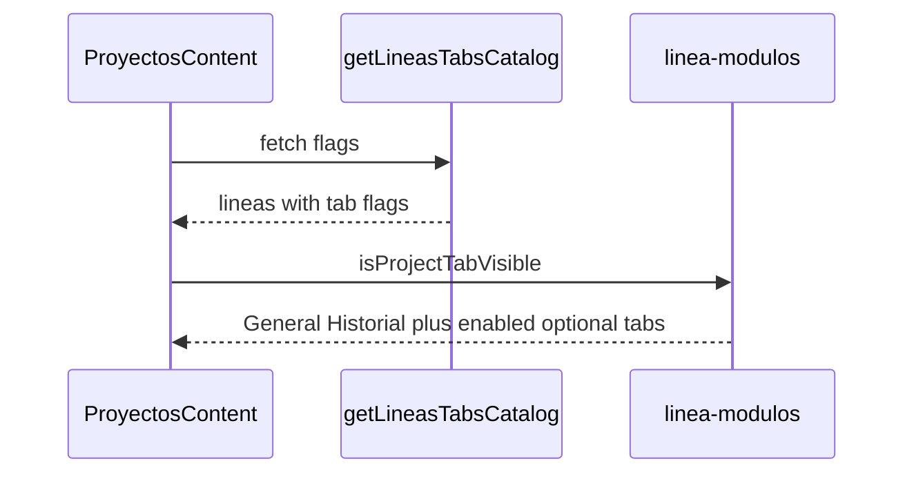

# Design: linea-modulos-config

## Source of truth
`Linea.tab*Enabled` for project tabs. DT remains opt-out via `DesarrolloTecnicoSubcategoriaLineaExcluida`. `Proyecto.linea` is still a denormalized name; match is fondo nombre + línea nombre.

## Flags on Linea
- Convenio / Escalamiento: default false (opt-in), copied from Fondo on migrate
- Participantes, Actividades, Indicadores, Presupuesto, Seguimiento: default true

`Fondo.conveniosEnabled` and `escalamientoEnabled` stay in the schema unused.

## Pure module
`src/lib/linea-modulos.ts` owns matching, visibility, and convenio key sets so UI and server listings share one behavior.

## Config UI
`/configuracion/lineas`: matrix, columns = líneas grouped by fondo, rows = optional tabs then DT subcategories grouped by category. Switch On/Off per cell.

## Runtime
`ProyectosContent` loads `getLineasTabsCatalog()` once and filters `PROJECT_NAV_TABS`. Hidden active tab falls back to General.

Convenio/Escalamiento actions load the línea row and check the flag.

## Sequence (tab visibility)

