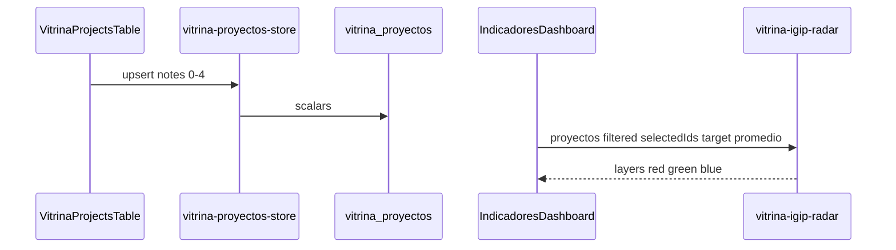

# Design: portal-igip-radial-indicadores

## Source of truth
Vitrina (`VitrinaProyecto`), not Bitácora `ProyectoIgip`. Eighteen nullable ints 0–4 (six subdimensions × Inicial / Proyección / Final). Decimal IGIP indexes stay independent. Sidebar-filtered `proyectos` are the universe for the radar selector and for Promedio azul.

## Pure modules
- `src/lib/vitrina-igip-scores.ts` — field names, stadium prefixes, optional 0–4 parse.
- `src/lib/vitrina-igip-radar.ts` — resolve selection, average per axis (skip nulls; empty axis → 0), layer order red → green → blue.
- `src/lib/igip-trl.ts` — shared radar math and `IGIP_SUBDIMENSIONS`.
- `src/lib/vitrina-igip-table.ts` — visible Data columns for IGIP/TRL, stadium chips, expand subdimensions.

## UI
- Extract `IgipRadarChart` SVG (rings, axes, polygons). `IgipTrlCard` keeps editable score overlays. Portal radar is read-only.
- `VitrinaIndicadoresDashboard`: chart type `radial` only when `kind === 'igip'`.
- `VitrinaProjectsTable`: secondary IGIP|TRL tabs; stadium visibility; expand 6 cols to the left of each IGIP index.

## Schema
Additive nullable integers on `vitrina_proyectos`. No DML. No seed.

## Sequence

