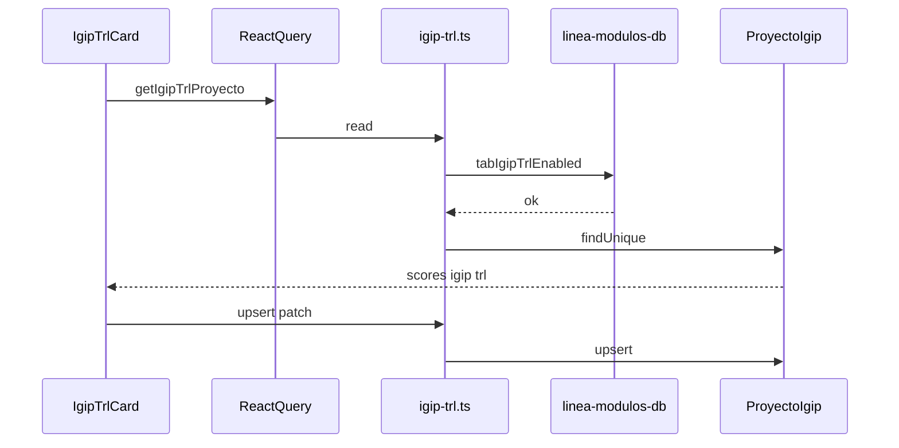

# Design: proyecto-tab-igip-trl

## Source of truth
Bitácora module on `Proyecto`, not `VitrinaProyecto`. Scores, IGIP index and TRL live in a 1:1 table `ProyectoIgip`. Visibility is `Linea.tabIgipTrlEnabled` (default true).

## Pure module
`src/lib/igip-trl.ts` owns labels, TRL copy, range validation, radar vertex math, and TRL visual state so UI and actions share one contract.

## Runtime
- Nav: `PROJECT_NAV_TABS` + `OPTIONAL_PROJECT_TABS` insert `IgipTrl` between Indicadores and Presupuesto.
- UI: `IgipTrlTab` + `IgipTrlCard` (SVG radar, IGIP input, TRL stack). Optimistic upsert via React Query.
- Server: `getIgipTrlProyecto` / `upsertIgipTrlProyecto` with `requireProjectAccess` + línea gate, historial, `revalidatePath('/proyectos')`.

## Schema
Additive only: `lineas.tab_igip_trl_enabled` default true; table `proyecto_igip` with six nullable ints, `igip` Decimal(12,4), `trl` Int, unique `proyecto_id`, cascade delete.

## Sequence

